# Tugas 1

### Menjalankan Server dengan 3 port yang berbeda.Server memiliki IP 10.151.253.49 ,pesan yang dikirmkankan adalah "Teknik Informatika"

Keterangan : Disini PC saya menjadi Client  dengan IP Addres 10.151.252.191
             dan Server Diisi PC teman saya dengan IP Addres 10.151.253.49
             
*Screenshoot dari terminal diambil dari sudut pandang kedua PC

#### Port 31001
##### Server Mencari Koneksi

##### Client Menyambungkan 
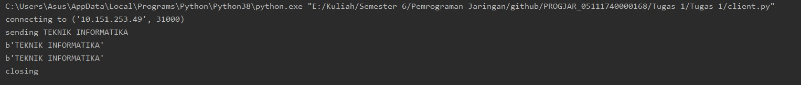

#### Server Menerima Pesan
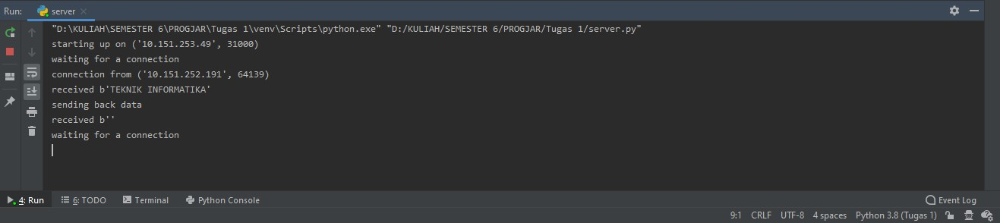

#### Port 31001

##### Server Mencari Koneksi

##### Client Menyambungkan

#### Server Menerima Pesan

#### Port 31002

##### Server Mencari Koneksi
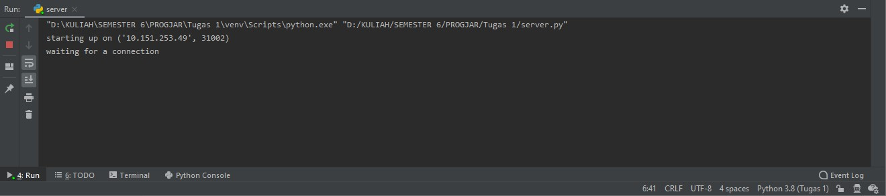
##### Client Menyambungkan
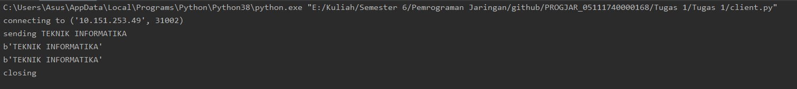
#### Server Menerima Pesan
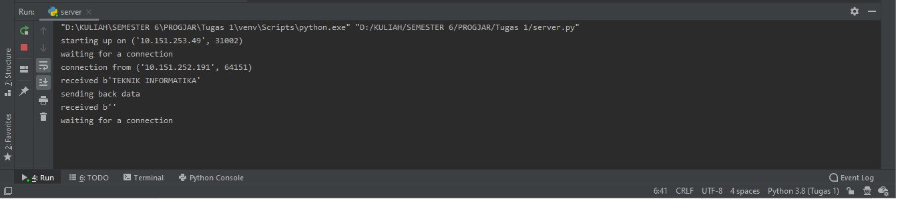

## Tugas 1a
Soal : MODIFIKASILAH program client.py dan server.py agar dapat MENTRANSFER file dari client ke server (letakkan program modifikasi di direktori tugas1a)

#### Direktori ketika server belum menerima file
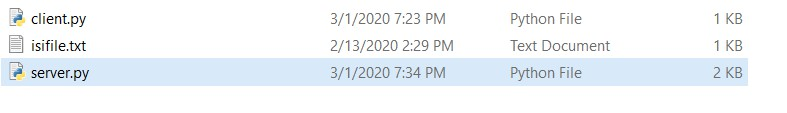
#### Server Mencari Koneksi
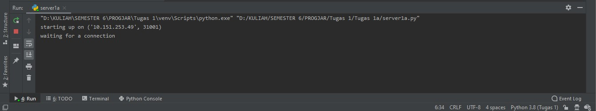
#### Client menyambungkan untuk mengirim file ke server
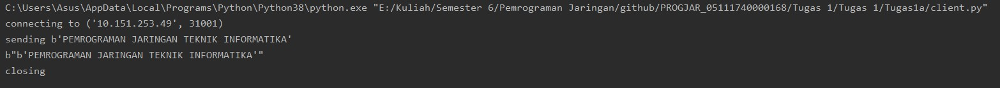
#### Server menerima file 
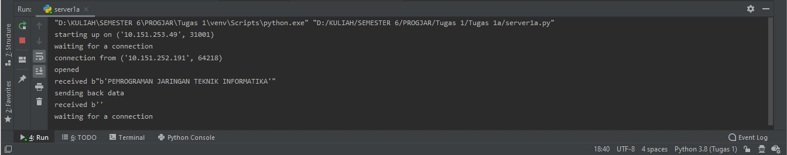
#### Direktori ketika server sudah menerima file,disimpan dengan nama received_file.txt

## Tugas 1b
Soal : MODIFIKASILAH program server.py agar dapat mengirimkan MENTRANSFER FILE yang di request oleh client (letakkan program modifikasi di direktori tugas1b)

#### Direktori ketika server belum menerima file

#### Server Mencari Koneksi
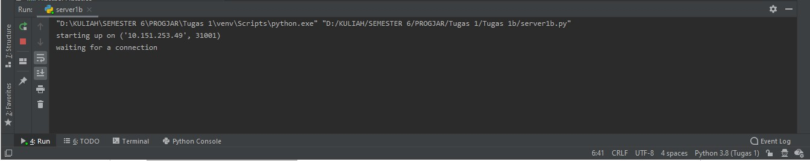
#### Client menyambungkan untuk request file ke server
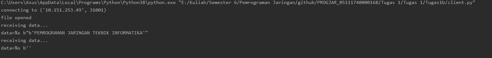
#### Server mengirim file 
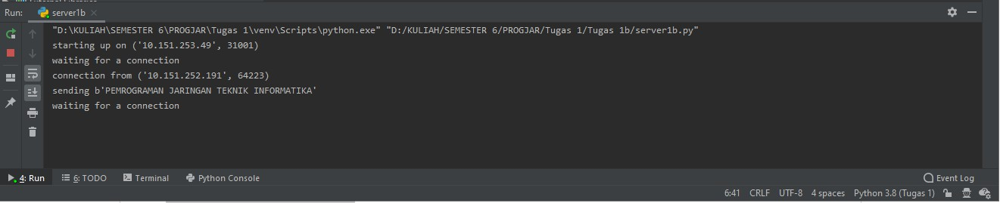
#### Direktori ketika client sudah menerima file,disimpan dengan nama received_file.txt
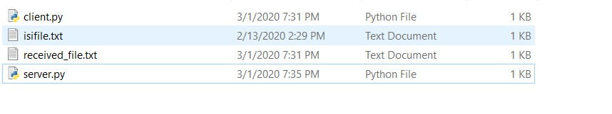
