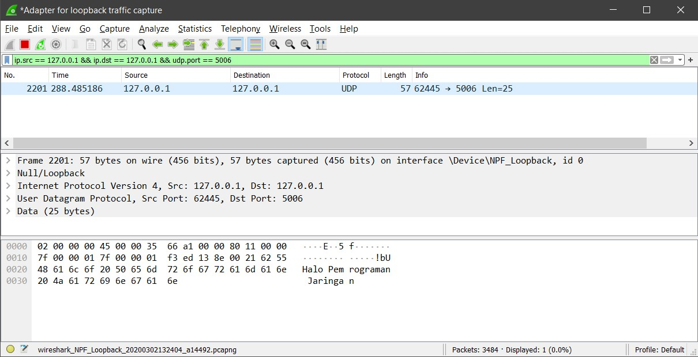
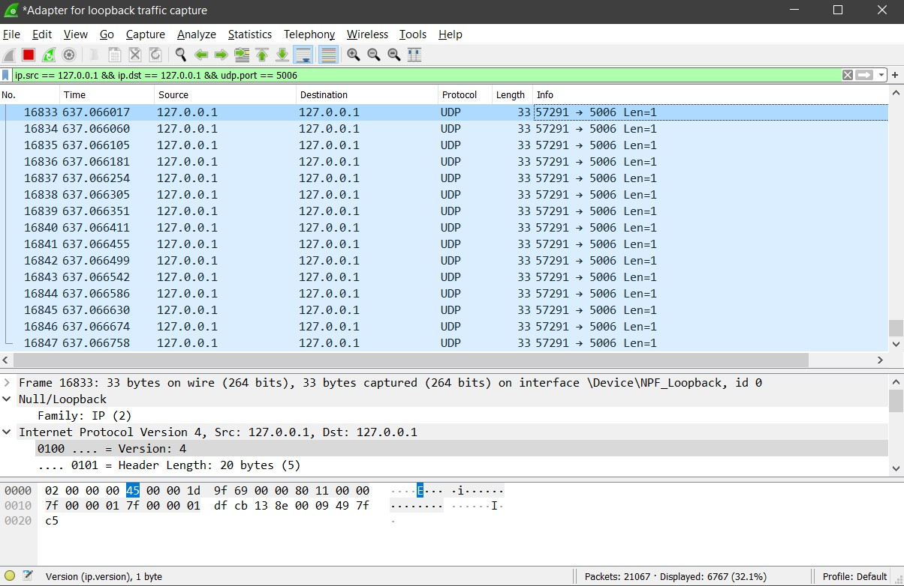
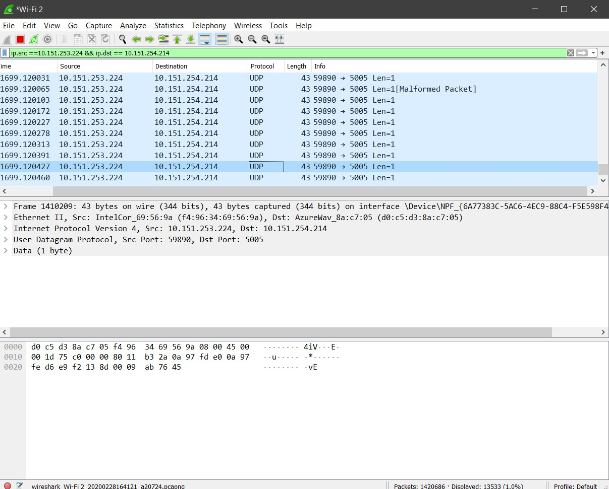

# Tugas 2 
### Menjalankan udp_simple Pc dari localhost menuju localhost (ip.src = 127.0.0.1 && ip.dst == 127.0.0.1).

### Menjalankan udpfileclient Pc dari localhost menuju localhost (ip.src = 127.0.0.1 && ip.dst == 127.0.0.1).

## Bisa juga dijalankan antar pc
### Menjalankan udp_simple Pc ip=10.151.253.224 ke pc lainnya ip 10.151.254.214.
Pesan yang dikirmkankan adalah "Halo Pemrograman Jaringan"

### Menjalankan udpfileclient Pc ip=10.151.253.224 ke pc lainnya ip 10.151.254.214.
File yang dikirimkankan adalah bart.png 

