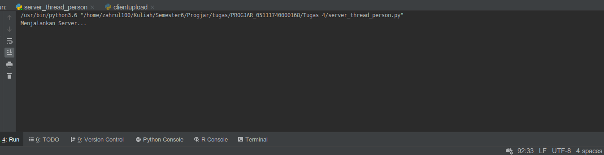
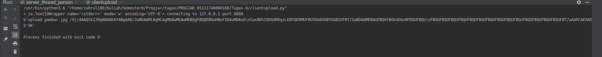
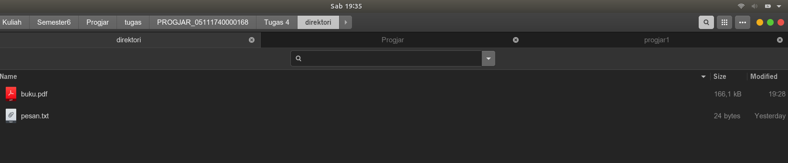
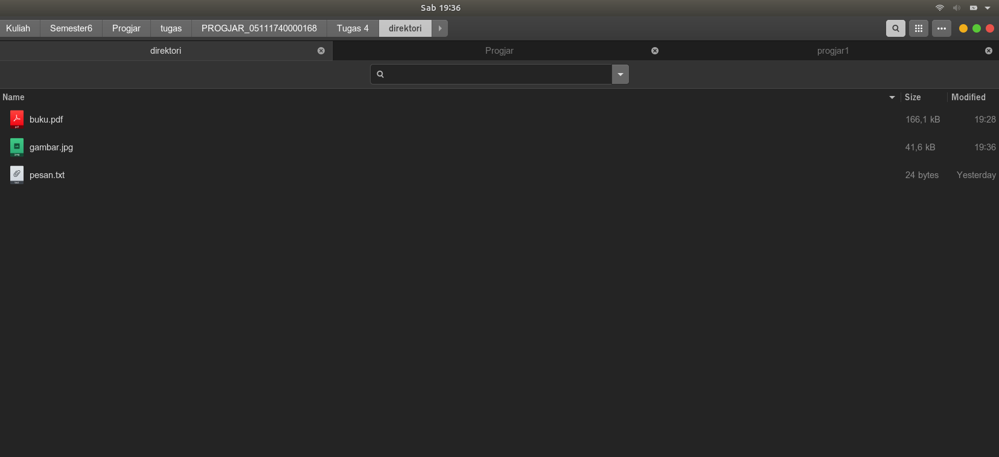
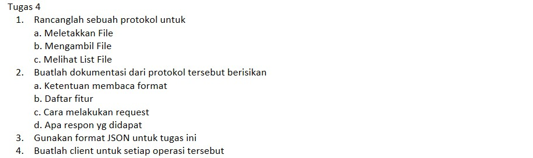
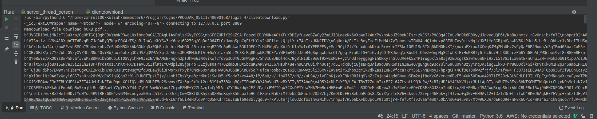
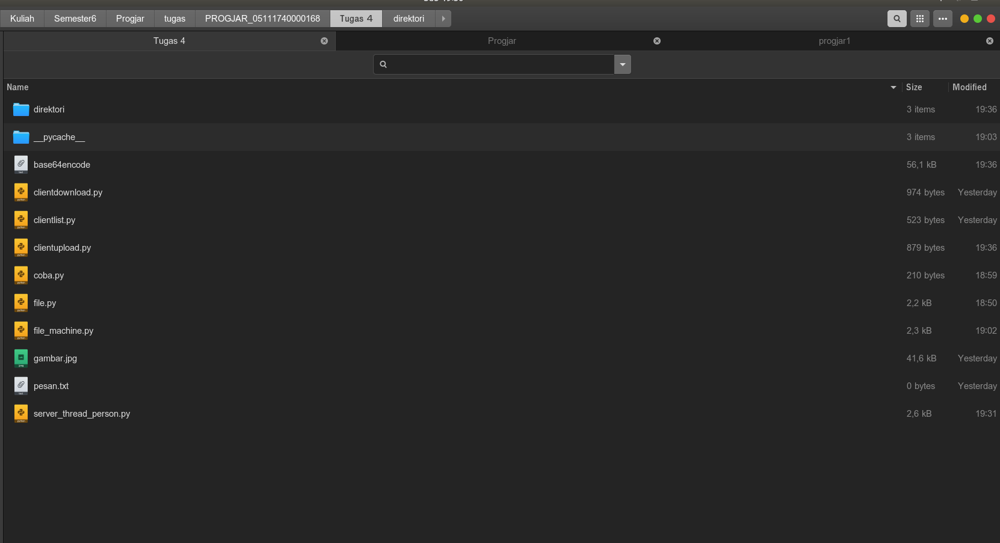
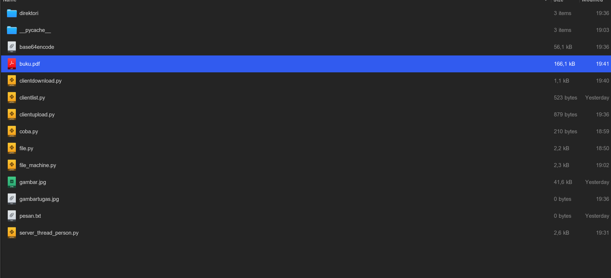
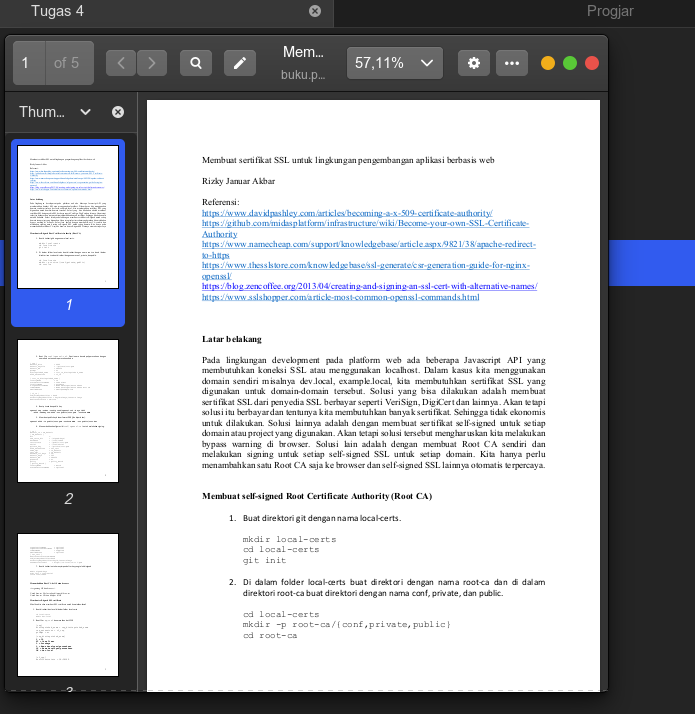
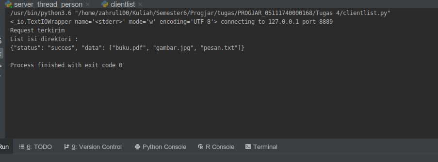

# Tugas Progjar 4
## PROTOCOL FORMAT
'''
PROTOCOL FORMAT
string terbagi menjadi 2 bagian, dipisahkan oleh spasi
COMMAND spasi PARAMETER spasi PARAMETER ...
FITUR
- upload : untuk mengupload file ke direktori
  request : upload
  parameter : namafile spasi isifile
  response : berhasil -> ok,(terupload file di folder direktori)
             gagal -> error
- list : untuk melihat daftar dalam direktori
  request: list
  parameter: tidak ada
  response: daftar isi direktori file yang ada
- download : untuk mendownload file berdasarkan nama file
  request: download
  parameter: namafile yang ingin didownload
  response: memberikan unduhan file kepada client
- jika command tidak dikenali akan merespon dengan ERRCMD
'''

## Membuat Server untuk menerima request dan merespon client 
Menjalankan server_thread_file.py

## Mengupload File menggunakan client clientupload.py
### berikut adalah mengupload file menggunakan clientupload.py
Menjalankan clientupload.py yang didalamnya memiliki perintah "upload gambar.jpg isifile"

Isi direktori upload sebelum

Isi direktori upload sesudah 

Penampakan file gambar.jpg

## Mendownload File menggunakan client clientdownload.py
### berikut adalah mendownload file menggunakan clientlist.py
menjalankan clientdownload.py yang didalamnya memiliki perintah "download buku.pdf"

Isi direktori client sebelum

Isi direktori client sesudah 

Penampakan file buku.pdf

## Melihat isi list file menggunakan client clientlist.py
### berikut adalah Melihat isi direktori menggunakan clientlist.py
menjalankan clientlist.py yang didalamnya memiliki perintah "list"
dan output dalam bentuk Json

