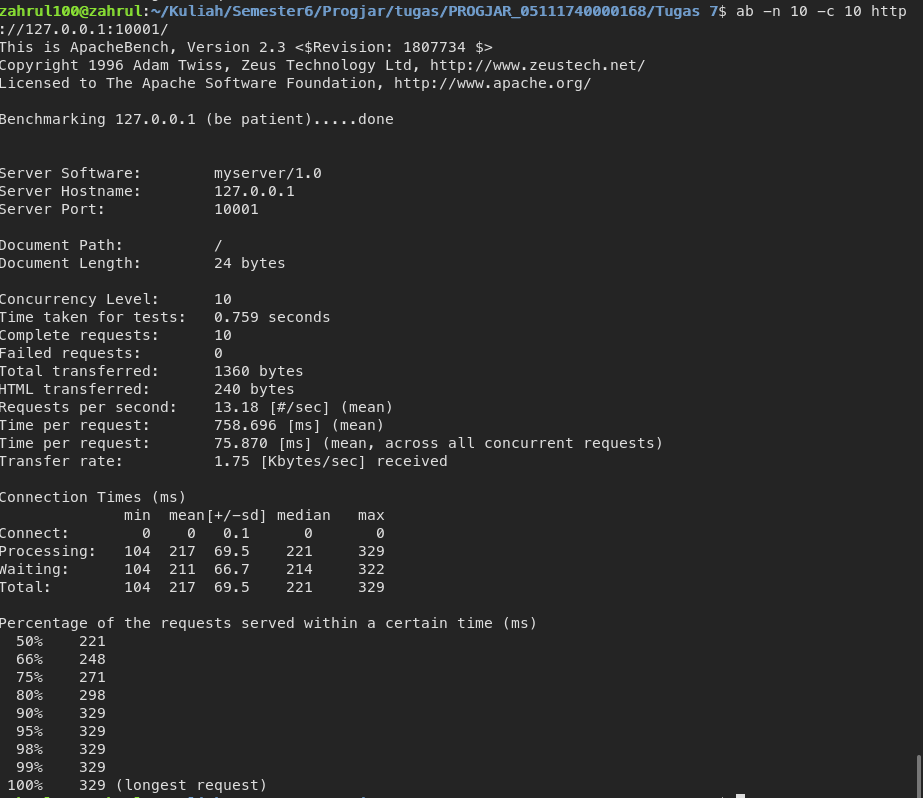
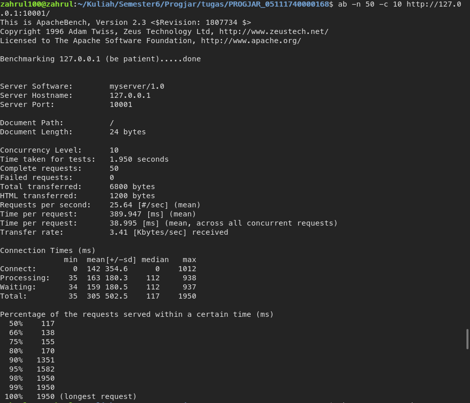
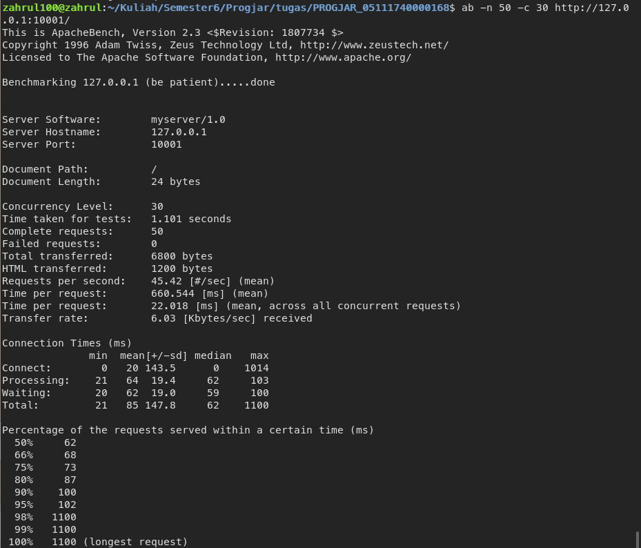
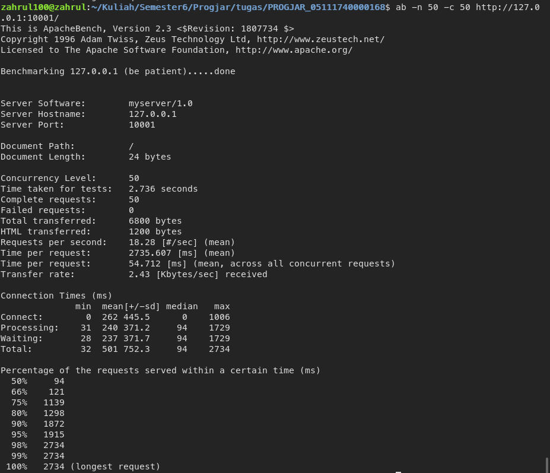
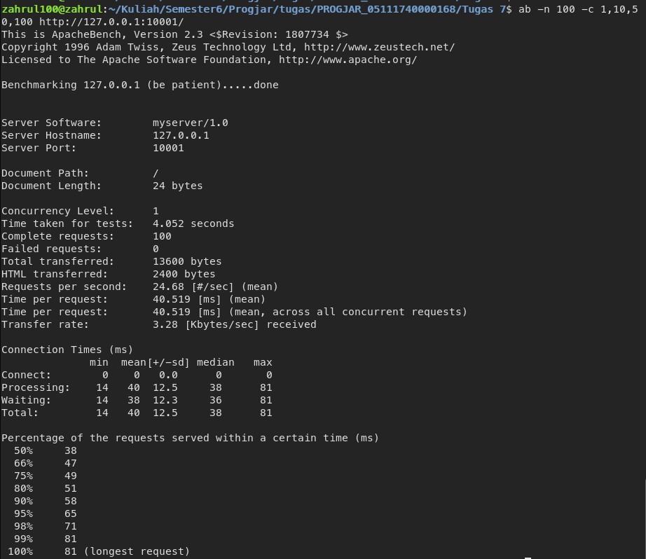

# Tugas 7 Pemrograman Jaringan

## Hasil Performa Test Menggunakan apache-benchmark
 
 <a href="https://github.com/zahrul100/PROGJAR_05111740000168/blob/master/Tugas%207/Performa%20Test.pdf"> Hasil Test</a>
 
## SS No 1
### 1a

### 1b

###1c

## SS No 2

## 2b

## 2c

## 2d

## SS No 3
## 3a

## 3b

## 3c

## 3d

