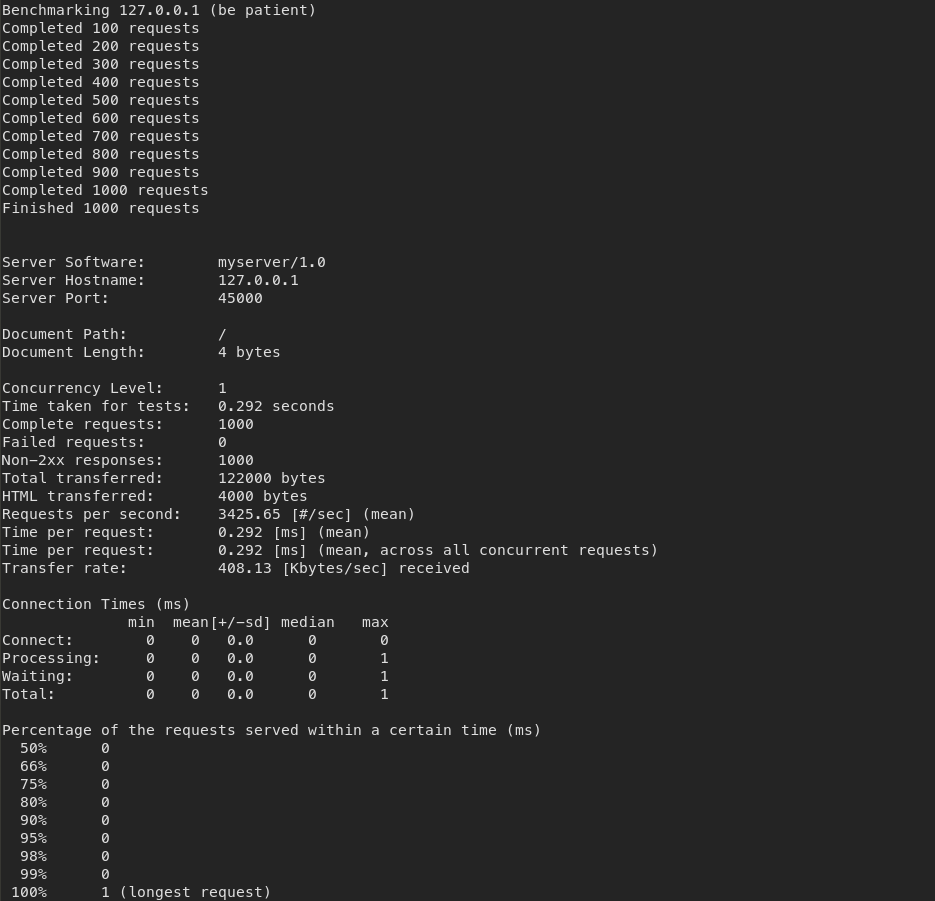
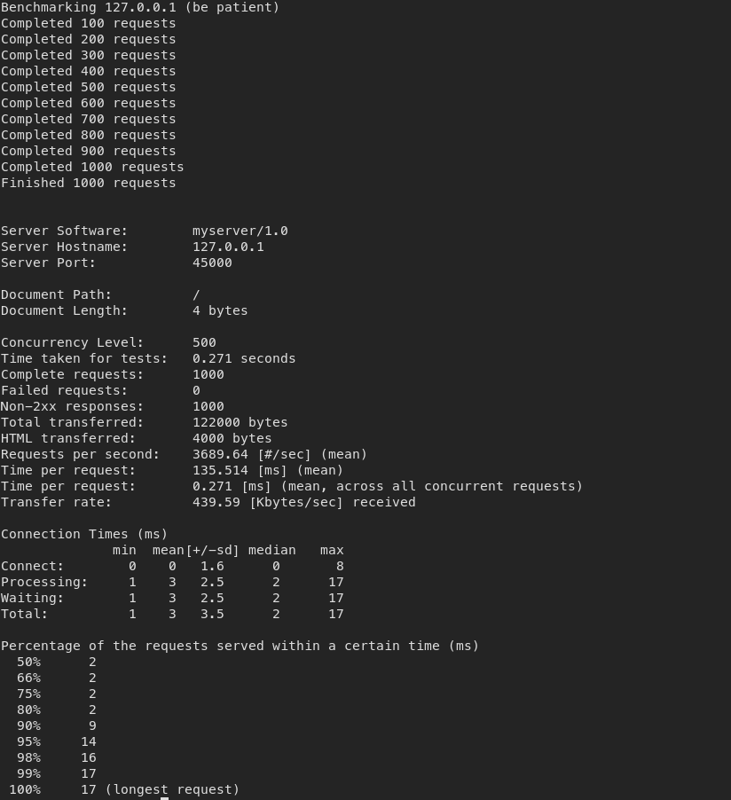
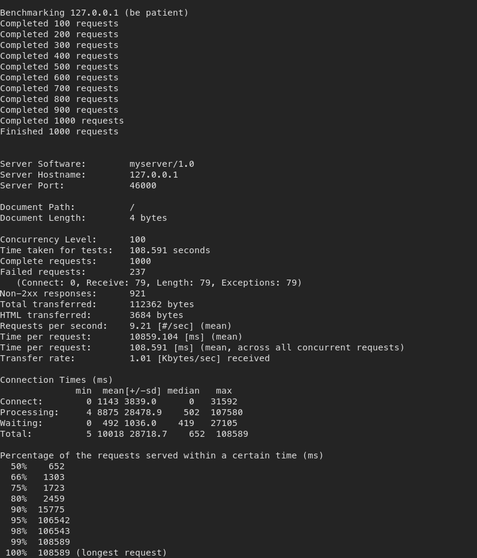
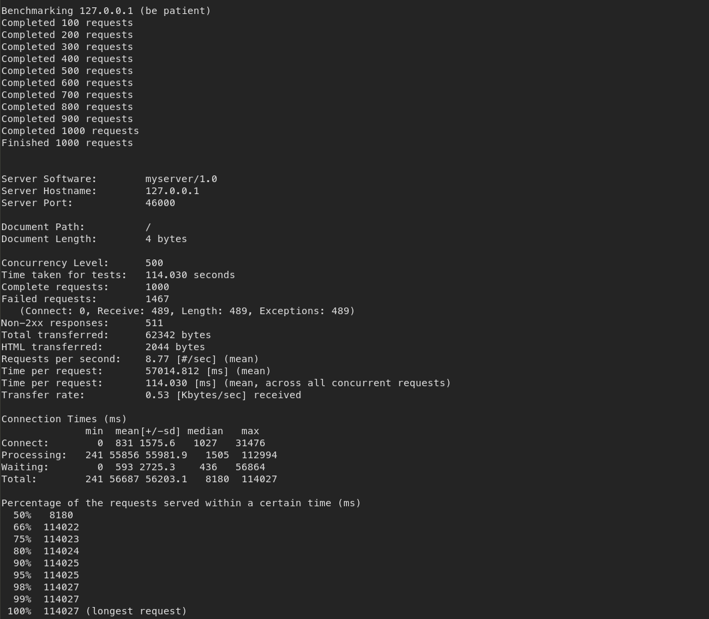

# Tugas 9
<a href="https://github.com/zahrul100/PROGJAR_05111740000168/blob/master/Tugas%209/LaporanTugas9.pdf"> Laporan Tugas 10</a> 

SS hasil

- server_async_http.py

ab -n 1000 -c 1 -r http://127.0.0.1:45000/

ab -n 1000 -c 10 -r http://127.0.0.1:45000/

ab -n 1000 -c 100 -r http://127.0.0.1:45000/

ab -n 1000 -c 500 -r http://127.0.0.1:45000/

ab -n 1000 -c 1000 -r http://127.0.0.1:45000/

- server_thread_http.py

ab -n 1000 -c 1 -r http://127.0.0.1:46000/

ab -n 1000 -c 10 -r http://127.0.0.1:46000/

ab -n 1000 -c 100 -r http://127.0.0.1:46000/

ab -n 1000 -c 500 -r http://127.0.0.1:46000/

ab -n 1000 -c 1000 -r http://127.0.0.1:46000/

